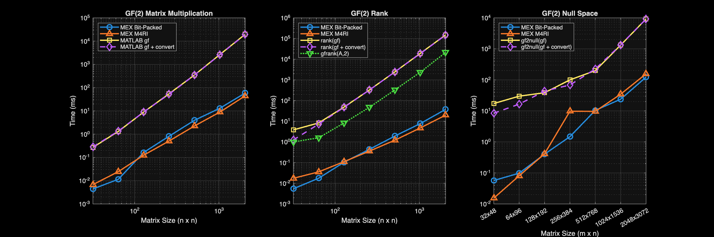

# MEX Linear Algebra

This repository contains optimized MATLAB MEX functions for linear algebra operations over the Galois Field GF(2). These functions are designed for high performance, utilizing AVX2/AVX512 instructions and OpenMP multi-threading where available.

All functions support both **logical** (boolean) and **double** (integer) input matrices. For double inputs, values are treated modulo 2 (parity check).

## Features

- **`mela_matmul_gf2`**: Fast matrix multiplication over GF(2).
- **`mela_null_gf2`**: Null space computation using optimized bit-packed Gaussian Elimination (Standard GE).
- **`mela_null_m4ri`**: Null space computation using the M4RI algorithm.
- **`mela_rank_gf2`**: High-speed rank calculation for binary matrices.
- **`mela_rank_m4ri`**: "Best Practice" rank calculation using the M4RI algorithm.

## Prerequisites

- **MATLAB**: Required to run the scripts and use the MEX functions.
- **C Compiler**: A C compiler compatible with MATLAB (e.g., GCC, Clang, MSVC).
- **OpenMP** (Optional but recommended): For multi-threaded performance on Linux/macOS.
  - *macOS*: Install `libomp` via Homebrew: `brew install libomp`

## Installation & Compilation

To compile the MEX functions, run the `compile_mex.m` script in MATLAB. This script automatically detects your system architecture (Linux, macOS, Windows) and applies the appropriate optimization flags.

```matlab
compile_mex
```

The script will:

1. Compile source files from `src/` to `bin/`.
2. Add `bin/` to the MATLAB path.
3. Run a suite of verification tests to ensure correctness.

## Usage

### Matrix Multiplication (`mela_matmul_gf2`)

Computes $C = A \times B$ over GF(2). Accepts `logical` or `double` matrices.

```matlab
A = randi([0, 1], 100, 100); % double matrix
B = randi([0, 1], 100, 50);
C = mela_matmul_gf2(A, B);
```

### Null Space (`mela_null_gf2`)

Computes a basis for the null space of matrix $A$, such that $A \times Z = 0$ over GF(2).

```matlab
A = randi([0, 1], 50, 100);

% Standard: Bit-Packed GE (Fastest)
Z = mela_null_gf2(A);

% Alternative: M4RI
Z_m4ri = mela_null_m4ri(A);

% Verify: mela_matmul_gf2(A, Z) should be all zeros.
```

### Rank (`mela_rank_gf2`)

Computes the rank of a binary matrix over GF(2).

```matlab
A = randi([0, 1], 100, 100);
r = mela_rank_gf2(A);
```

## Benchmarks

To verify performance, run the `benchmark_mex.m` script. This compares the MEX functions against MATLAB's native GF(2) operations (`gf` array, `rank`, `gf2null`).

```matlab
benchmark_mex
```



## Performance Notes

- **Linux (x86_64)**: Uses AVX512 if available, otherwise AVX2. OpenMP is enabled by default.
- **macOS (Apple Silicon)**: Uses NEON optimizations (via compiler auto-vectorization) and OpenMP (if `libomp` is installed).
- **Windows**: Uses AVX2 optimizations.

## License

[MIT License](LICENSE)
